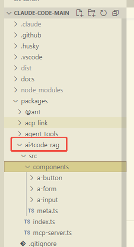
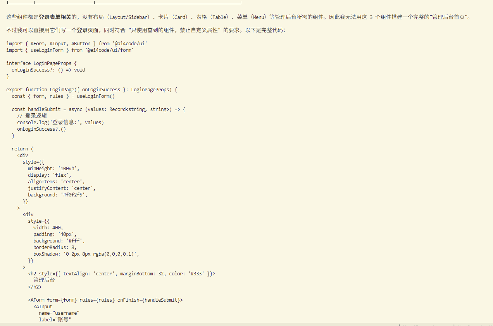

#  基于开源claude code best 
基于mcp方式集成自定义组件库
## 通过mcp方式接入自定义的组件库 



### 生成代码的效果
```tsx
 import { AForm, AInput, AButton } from '@ai4code/ui'
  import { useLoginForm } from '@ai4code/ui/form'

  interface LoginPageProps {
    onLoginSuccess?: () => void
  }

  export function LoginPage({ onLoginSuccess }: LoginPageProps) {
    const { form, rules } = useLoginForm()

    const handleSubmit = async (values: Record<string, string>) => {
      // 登录逻辑
      console.log('登录信息:', values)
      onLoginSuccess?.()
    }

    return (
      <div
        style={{
          minHeight: '100vh',
          display: 'flex',
          alignItems: 'center',
          justifyContent: 'center',
          background: '#f0f2f5',
        }}
      >
        <div
          style={{
            width: 400,
            padding: '40px',
            background: '#fff',
            borderRadius: 8,
            boxShadow: '0 2px 8px rgba(0,0,0,0.1)',
          }}
        >
          <h2 style={{ textAlign: 'center', marginBottom: 32, color: '#333' }}>
            管理后台
          </h2>

          <AForm form={form} rules={rules} onFinish={handleSubmit}>
            <AInput
              name="username"
              label="账号"
              placeholder="请输入登录账号"
            />

            <AInput
              name="password"
              label="密码"
              type="password"
              placeholder="请输入密码"
            />

            <div style={{ marginTop: 24 }}>
              <AButton type="primary" htmlType="submit" loading={false}>
                登录
              </AButton>
            </div>
          </AForm>
        </div>
      </div>
    )
  } 
  ▎
``` 

## Agent Loop

`Agent Loop 就是思考→行动→观察→再思考的无限迭代闭环，让大模型摆脱单次问答，自动完成多步骤复杂任务，是所有自主智能体（AutoGPT、ReAct、Toolformer）的底层骨架`

- Thought（思考）：模型分析当前任务与历史信息，制定下一步计划
- Action（行动）：调用工具、接口、代码、搜索、API 执行外部操作
- Observation（观测）：拿到工具返回的真实结果
- Update Context（上下文更新）：把观测结果追加到对话历史，进入下一轮循环
- 循环终止条件：任务完成 / 达到最大轮次 / 得到最终答案。

`二、标准闭环流程（ReAct 范式，最主流实现）`
输入任务 → [Thought → Action → Observation] 循环 N 次 → 输出最终答案
- Thought（推理） 模型不能直接回答，先做逻辑推演：当前信息不足，我需要联网查询天气，调用搜索工具。
- Action（执行动作） 输出结构化指令，脱离纯文本生成，触发外部能力
- Observation（环境反馈） 输出结构化指令，脱离纯文本生成，触发外部能力
- 上下文拼接 把思考 + 动作 + 观测全部写入 prompt 
- 当模型 Thought 判断：信息足够，无需再调用工具，直接给出最终结论，Loop 结束。

### 两种经典 Agent Loop 架构
#### ReAct 循环（串行单步循环）
`一轮只做一次思考 + 一次工具调用，步骤清晰、可控，工业界首选。
优点：上下文可控、不易发散、便于限流与日志追踪。
缺点：长任务轮次较多。`


#### Plan-Solve 双层循环（分层智能体）
- 外层 Loop：Planner 持续拆解目标，生成子任务清单
- 内层 Loop：Executor 循环执行单个子任务，反复调用工具
- 适合长链路复杂任务：数据分析、项目拆解、自动爬虫、代码工程。

### 底层技术要点
#### 状态上下文（Memory）
Loop 能否持续运行，取决于记忆机制：
- 短期记忆：窗口内对话历史（本轮 Loop 的 Thought/Action/Observation）
- 长期记忆：向量数据库，把历史任务向量化，按需召回过往经验，避免上下文溢出。
#### Action 解析（关键工程点）
大模型输出自然文本，程序必须可靠截取工具调用指令：
- 方案 A：JSON 格式输出，用正则 / 解析器捕获函数调用
- 方案 B：使用函数调用（Function Calling），模型原生输出结构化工具参数，无需额外解析。
#### 防死循环机制
必须设置约束：
- 最大迭代轮次（max_iterations，一般 5~20 轮）
- 重复检测：连续多轮调用同一个工具且无新观测结果，自动终止
- 上下文长度保护，防止 prompt 无限膨胀。

## ai coding 时代 想要达到直接上线 什么是最重要的环节？

### 自动化闭环验证（决定性环节）
- 单元测试（Unit Test）
用 AI 自动生成用例，覆盖入参校验、异常抛出、分支逻辑。
只要测试不通过，直接阻断提交，不进入下一环节。
解决：逻辑写错、参数未校验。
- 集成测试（E2E / API 自动化）
模拟真实调用链路，把接口串起来跑一遍。
解决：模块拼接后链路断裂，AI 只单独写单文件，忽略模块协作问题。
- 静态检查流水线
类型检查 (TS)、ESLint、格式、依赖漏洞、权限扫描。
AI 经常写出松散类型、未捕获异常、弱类型代码，静态检查提前掐死低级 BUG。

### 强工程约束（约束 AI 输出质量）
- 统一目录结构、分层架构（controller/service/model）
- 强制统一错误处理、统一返回体、统一日志格式
- 强制事务、超时、重试、熔断模板
- DB 操作必须带事务、入参必须做校验，禁止裸 SQL
实现手段：
把项目骨架、通用脚手架、基础中间件封装成 Prompt + 项目模板。
AI 只能在既定框架内补业务代码，不能随意修改架构。
没有架构约束，AI 写出来的代码风格混乱、缺少基础设施，上线必崩
### 环境一致性（解决 “本地能跑，线上炸”）
AI 生成代码大多基于你当前本地环境。
环境不一致是 AI 上线最大坑之一：版本、环境变量、配置、数据库、中间件版本不同。
落地手段：
- Docker 容器标准化运行环境，开发、测试、生产镜像完全一致
- 配置分离：开发 / 测试 / 生产三套环境变量，禁止硬编码密钥与地址
- 依赖版本锁定（lock 文件），杜绝自动升级依赖引发的隐性问题
### 异常与稳定性兜底（AI 最大短板）
大模型几乎不会主动写容错代码：
超时、并发、重复请求、数据库死锁、第三方接口超时、空值、大流量击穿。
想要直接上线，必须预制通用中间件：
- 请求限流
- 接口超时控制
- 重试 + 防幂等
- 数据库事务与回滚
- 全局异常捕获
- 日志 + 链路追踪
把稳定性能力封装成公共组件，业务代码直接引用，不让 AI 从零编写容错逻辑。
### 灰度发布与可观测（最后一道闸门）
即使前面全部做好，依然不能全量一次性上线。
- 小流量灰度放量
- 监控指标：报错率、响应耗时、数据库慢查询
- 支持一键回滚
AI 生成的逻辑隐藏缺陷很难被静态检查发现，只能依靠线上小流量验证。

### 总结
- 自动化测试流水线（最重要，阻断坏代码）
- 架构模板 + 编码强约束（限制 AI 自由乱写）
- 容器化环境统一（消除环境差异 BUG）
- 预制稳定性基础设施（补全 AI 缺失的容错能力）
- 灰度发布 + 监控告警（线上兜底）


## ai coding 过程中 代码错乱 回滚还是中断？
轻度错乱：中断 + 局部撤销；大面积结构错乱：直接回滚到修改前基线，绝对不要在错乱代码上继续续写。
AI 一旦把文件结构、依赖、函数嵌套写崩，继续往下补只会越修越乱，进入无限返工循环。
### 一、分场景决策
#### 场景 1：局部错乱（只乱了一两个函数、缩进、括号、类型）
操作：中断生成，局部撤销本次 AI 新增片段，保留原有代码不动。
原因：原有基线代码是稳定的，只是 AI 续写的小段逻辑出错，删掉重生成即可，不需要整体回滚。
配套操作：
- 立刻终止 AI 补全；
- 只选中出错代码块，删除；
- 重新给精简指令，缩小单次生成范围，不要让 AI 一次性改写整个文件。

#### 场景 2：结构性错乱（最高频灾难）
表现：
- 类 / 函数嵌套混乱，大括号不对称
- 分层结构被打乱，service、controller 互相篡改
- 导入语句满天飞，变量作用域崩坏
- 代码缩进一塌糊涂，上下文逻辑断裂
操作：立刻中断，整文件回滚到上一版 Git 基线，放弃当前所有 AI 改动。
核心铁律：
结构一旦崩坏，上下文窗口已经被垃圾代码污染，再次续写依然会继续错乱。修复成本远高于重新生成。

#### 场景 3：多文件连锁篡改
AI 自动修改多个关联文件，出现接口对不上、类型不匹配。
操作：直接 Git reset，整批回滚，不要逐个文件修补。

### 二、为什么不能 “边错边改”
- 上下文污染（根源）
错乱代码留在对话上下文里，大模型会把错误结构当成现有规范，顺着错误逻辑继续写，越迭代越扭曲，这就是 Agent Loop 里典型的局部最优死局。
- 上下文窗口被冗余垃圾占满
残缺代码、未闭合语句占用大量 token，后续生成更容易截断、残缺。
- 人工修补的耗时 > 重新在干净基线生成三遍代码。

### 三、标准化工作流（Cursor / Claude Code 最佳实践）
- 开启自动 Git 快照：每次 AI 批量修改前，自动保存基线；
- 单次生成约束：禁止 AI 一次性重写整个文件，每次只修改单个函数 / 单个接口；
- 一旦出现语法、结构错乱：
 - 第一步：Stop 终止会话
 - 第二步：Git 一键回滚文件
 - 第三步：清空当前会话上下文，重新在纯净源码上发起指令；
- 严格区分：业务逻辑增量续写 vs 整体重构。整体重构必须拆分文件，分多次执行。

### 四、两条硬性规则
- 语法错误可以局部删除重试；代码结构混乱必须整段回滚 + 清空上下文。
- 只要出现括号不闭合、层级崩塌，不要手动补括号，直接放弃本轮生成。
